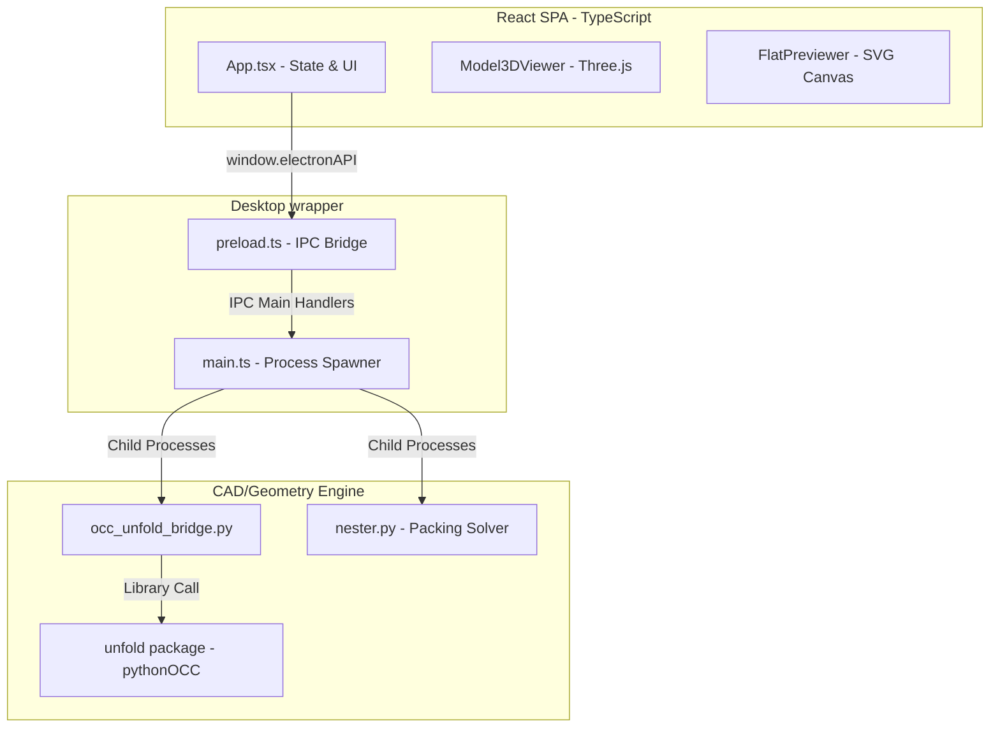
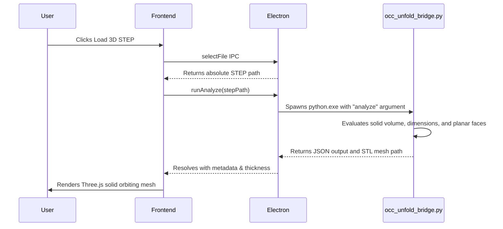
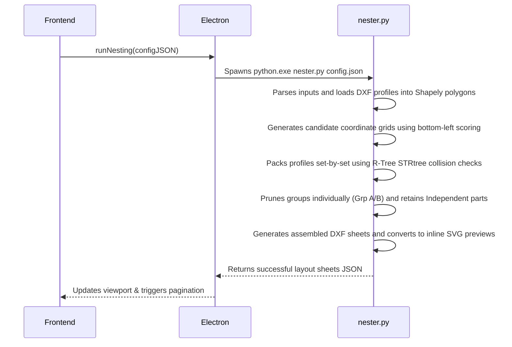

# Cadanest Technical Architecture & Systems Design

This document details the software architecture, tech stack, project layout, data flows, and geometric data pipelines of Cadanest.

---

## 1. System Architecture Map

Cadanest is built on a **decoupled multi-process desktop architecture** combining an Electron wrapper, a React SPA, and a Python CAD/geometry engine:



---

## 2. Technology Stack

### Frontend Core
- **React (TSX)**: Declarative component-based UI.
- **Three.js / WebGL**: Orbiting 3D viewport rendering step solid meshes.
- **Vanilla CSS / Custom Utility Tokens**: Sleek industrial-dark theme.
- **Lucide React**: Vector icon assets.

### Electron Desktop Integration
- **Electron (TypeScript)**: OS window framing and native filesystem access.
- **contextBridge & preload**: Isolates frontend from Node.js APIs to ensure security (OWASP standards).
- **child_process (spawn)**: Runs background Python geometry subprocesses.

### Python Geometry Backend (FreeCAD Python 3.11 Environment)
- **pythonOCC (Open CASCADE)**: B-Rep geometry kernel, face graph analysis, recursive matrix transformations.
- **Shapely**: 2D constructive solid geometry (CSG), buffering, union-dissolving, and R-Tree spatial indexing.
- **ezdxf**: Production-grade DXF drawing writer (`CUT` and `BEND_LINES` layers).
- **ezdxf-svg**: Converts DXF profiles directly to SVG data strings for rapid web previews.

---

## 3. Directory Layout & Code Symbol Responsibilities

```
c:\Users\gaash\Desktop\Projects\Cadanest\
├── package.json               # Project manifest, dev server, and packaging scripts
├── tsconfig.json              # TypeScript rules for frontend and Electron
├── Documentations\            # Architectural and feature specification documents
│   ├── context.md             # Codebase refactoring context
│   ├── architecture.md        # [THIS FILE] Core systems map & data flows
│   ├── unfolding_engine.md    # 3D OCC unfolding pipelines
│   └── nesting_solver.md      # 2D packing heuristics & set composition
├── src-electron\
│   ├── main.ts                # App lifecycle, process manager, and IPC spawner handlers
│   └── preload.ts             # Direct contextBridge exposing secure window.electronAPI
├── src\
│   ├── App.tsx                # Main view router, setup checklists, sidebar config, and live-sync loops
│   ├── index.css              # Color tokens, glassmorphism panel styles, and anim transitions
│   └── components\
│       ├── Model3DViewer.tsx  # Three.js viewport for STL orbiting rendering
│       └── FlatPreviewer.tsx  # SVG vector renderer with canvas panning, zoom, and fit-screen
├── backend\
│   ├── occ_unfold_bridge.py   # CLI wrapper for STEP solid queries and unfolding execution
│   ├── nester.py              # CLI irregular packing solver, set balancer, and DXF assembler
│   └── unfold\
│       ├── __init__.py        # Package exports
│       ├── step_loader.py     # Parses STEP solids and extracts face geometry
│       ├── face_graph.py      # Identifies coplanar neighbors and thickness parameters
│       ├── bend_math.py       # K-factor calculations for bend allowances
│       ├── unfolder.py        # Performs recursive BFS rotation-flattening of adjacent face sheets
│       └── dxf_export.py      # Dissolves internal co-planar tangent boundaries using Shapely CSG
```

---

## 4. Systems Data Flows

### A. 3D STEP Import & Topology Analysis Flow


### B. Irregular Shape Nesting Solver Pipeline


---

## 5. IPC Interface Schema (Context Bridge)

The preload Context Bridge exposes `window.electronAPI` with the following methods:

| Method Name | Arguments | Returns | Description |
| :--- | :--- | :--- | :--- |
| `selectFile` | None | `Promise<string[] \| null>` | Prompts OS open file dialog for `.step` / `.stp` models. |
| `runAnalyze` | `stepPath: string` | `Promise<AnalysisResult>` | Triggers OCC analysis to fetch thickness and faces list. |
| `runUnfold` | `{ stepPath, kfactor, baseFace }` | `Promise<UnfoldResult>` | Flatten selected root face to unique output DXF path. |
| `runNesting` | `{ sheetWidth, sheetHeight, spacing, margin, autoFill, rotations, exportFilename, parts }` | `Promise<NestingResult>` | Solves irregular shape nesting across sheet stock. |
| `cancelProcess`| None | `Promise<boolean>` | Terminates any active background python subprocesses. |
